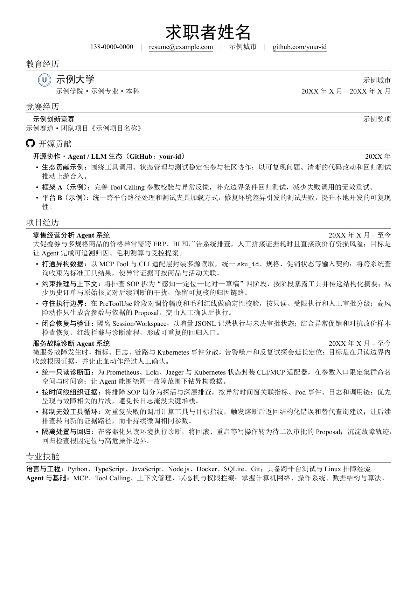

# 单页 LaTeX 简历示例

基于 `ctexart` 的可编辑中文单栏简历。`main.tex` 是正文，`assets/` 包含示例校徽和 GitHub 图标，`main.pdf` 是编译预览。



> 这是脱敏示例。姓名、联系方式、学校、日期、竞赛和开源贡献均为占位内容；使用前请按真实经历修改，不要直接作为个人履历投递。

## 本地编译

安装 MiKTeX 或 TeX Live 后，在仓库目录运行：

```powershell
xelatex -interaction=nonstopmode -halt-on-error main.tex
xelatex -interaction=nonstopmode -halt-on-error main.tex
```

用 XeLaTeX 编译中文。修改 `main.tex` 后重新编译即可更新 PDF。

## Overleaf

新建空白项目，上传 `main.tex` 和整个 `assets/` 目录；将主文件设为 `main.tex`、编译器设为 XeLaTeX，然后点击 Recompile。

## 修改内容

- 页眉：姓名、电话、邮箱、城市、GitHub 名称。
- 教育经历：学校、学院、专业、学历与时间；可替换 `assets/university-emblem.pdf`。
- 竞赛、开源和项目经历：将示例叙述替换为可核验的真实经历。
- PDF 元数据：同步修改 `main.tex` 中的 `pdfauthor` 和 `pdftitle`。
